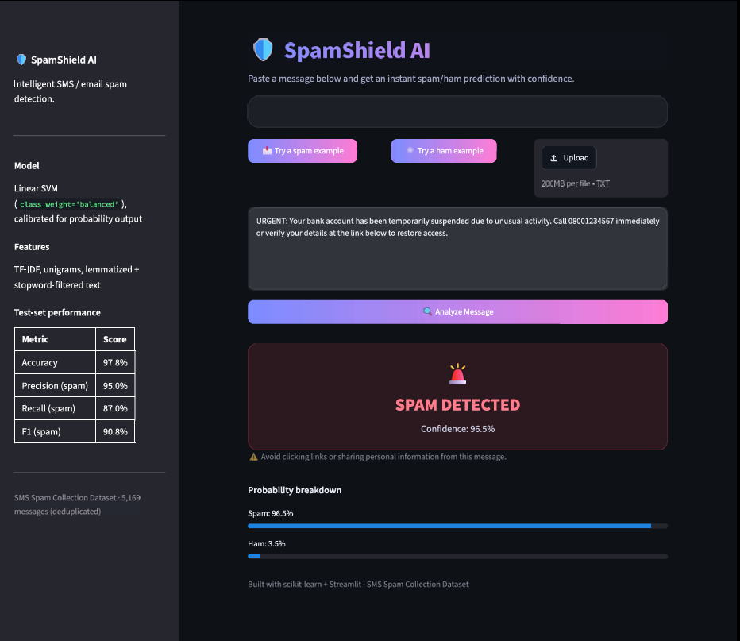
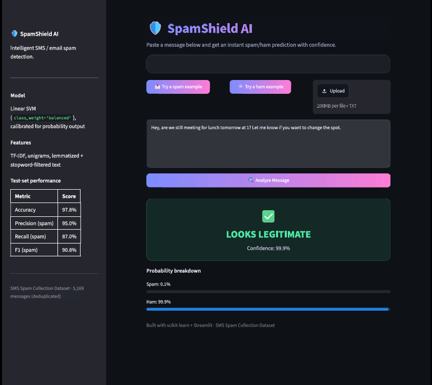

# 📧 Spam Email Detection

A complete machine learning pipeline that classifies SMS/email messages as **Spam** or **Ham** (legitimate), built as an INSA project assignment. Includes data exploration, text preprocessing, TF-IDF feature extraction, comparison of three classification models, evaluation, and a deployed Streamlit web app.

## 🔍 Overview

**Pipeline:** Dataset → Data Loading → EDA → Text Preprocessing → Feature Extraction (TF-IDF/BoW) → Train/Test Split → Model Training → Model Evaluation → Spam Prediction → Deployment

**Dataset:** [SMS Spam Collection Dataset](https://archive.ics.uci.edu/dataset/228/sms+spam+collection) — 5,572 labeled SMS messages (`ham` / `spam`).

**Best model:** Linear SVM (`LinearSVC`, `class_weight="balanced"`) trained on TF-IDF features, chosen after comparing it against Multinomial Naive Bayes and Logistic Regression.

| Model | Accuracy | Precision | Recall | F1-Score |
|---|---|---|---|---|
| **Linear SVM** ✅ | **0.978** | **0.950** | 0.870 | **0.908** |
| Logistic Regression | 0.973 | 0.906 | 0.878 | 0.891 |
| Multinomial Naive Bayes | 0.970 | 0.879 | 0.885 | 0.882 |

## 🖥️ Preview

| Spam Detected | Legitimate Message |
|---|---|
|  |  |

## 📁 Project Structure

```
spam-email-detection/
├── data/
│   └── spam.csv
├── notebook/
│   └── spam_email_detection.ipynb
├── model/
│   ├── spam_model.pkl
│   └── tfidf_vectorizer.pkl
├── streamlit_app.py
├── calibrate_model.py
├── requirements.txt
└── README.md
```

## ⚙️ Setup

```bash
git clone <this-repo-url>
cd spam-email-detection
pip install -r requirements.txt
```

The first run will download a few small NLTK corpora (`stopwords`, `wordnet`, `punkt`) automatically.

## 📓 Run the Notebook

```bash
cd notebook
jupyter notebook spam_email_detection.ipynb
```

Walks through every step of the assignment: dataset collection, loading, EDA, text preprocessing, TF-IDF feature extraction, train/test split, training and comparing 3 models, evaluation (accuracy/precision/recall/F1/confusion matrix), predicting new messages, and saving the final model.

## 🌐 Run the Web App

```bash
streamlit run streamlit_app.py
```

Opens automatically at **http://localhost:8501**. Paste a message (or use the built-in spam/ham examples) to get an instant prediction with a confidence score.

If `model/spam_model.pkl` doesn't yet support probability output, regenerate it with:

​```bash
python calibrate_model.py
​```

## 🧠 How It Works

1. **Preprocessing** — lowercase, strip punctuation/numbers, tokenize, remove stopwords, lemmatize.
2. **Feature extraction** — TF-IDF vectorization of the cleaned text.
3. **Modeling** — Multinomial Naive Bayes, Logistic Regression, and Linear SVM are trained and compared on a stratified 80/20 train/test split; the model with the best F1-score is kept.
4. **Deployment** — the trained vectorizer + model are serialized with `joblib` and the model is wrapped in CalibratedClassifierCV so it can output real probabilities, and both are served through a Streamlit app with a live confidence score.

## 📊 Results

- **Accuracy:** ~97.8%
- **F1-score (spam class):** ~0.91
- Confusion matrices and full classification reports for all three models are in the notebook.

## 📝 License

For educational purposes (INSA coursework).
